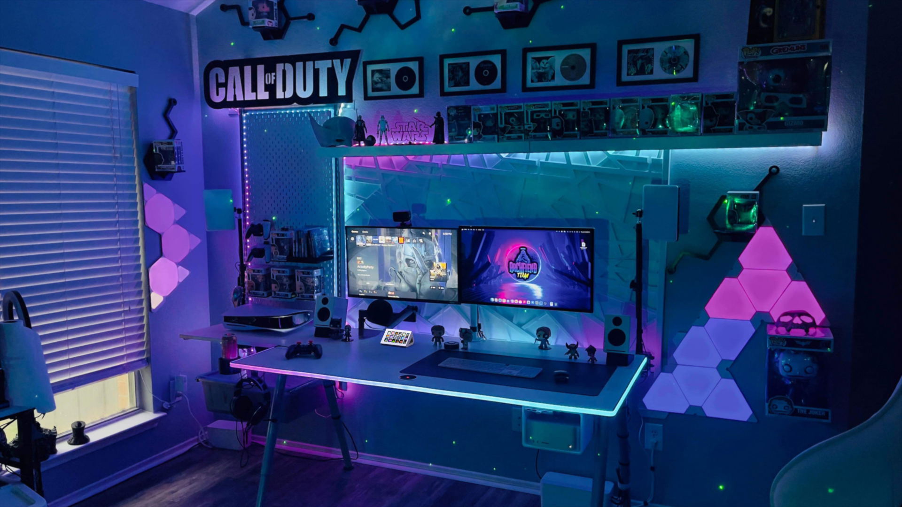
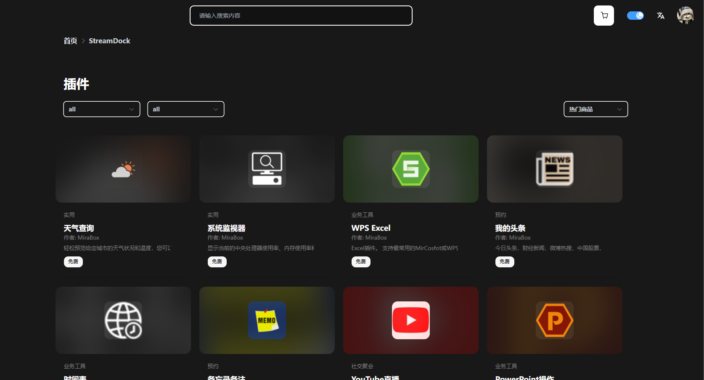
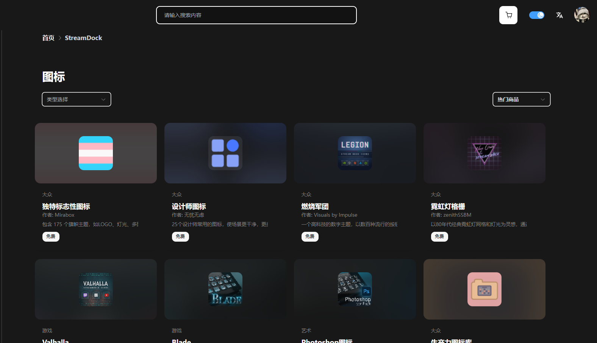
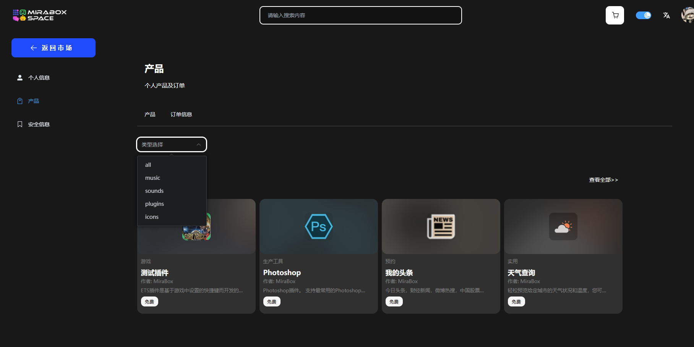
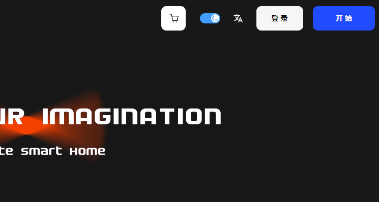
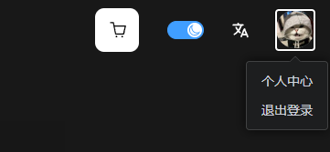
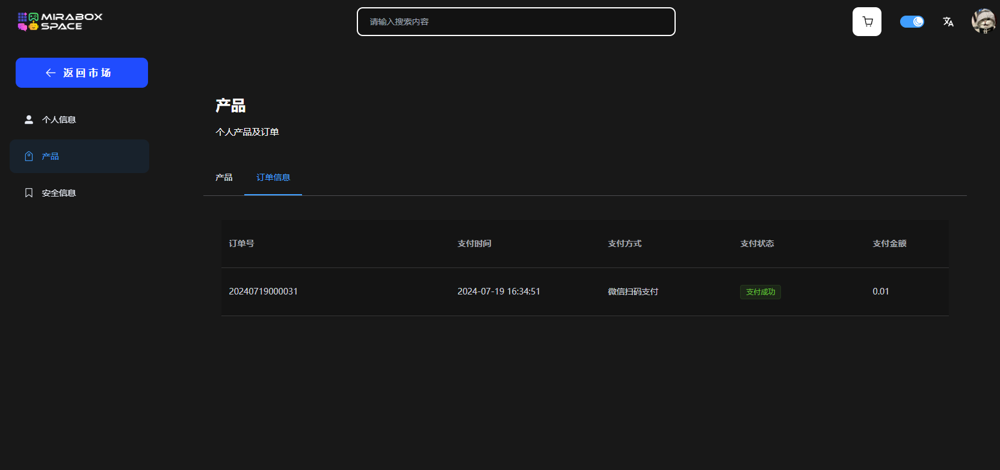
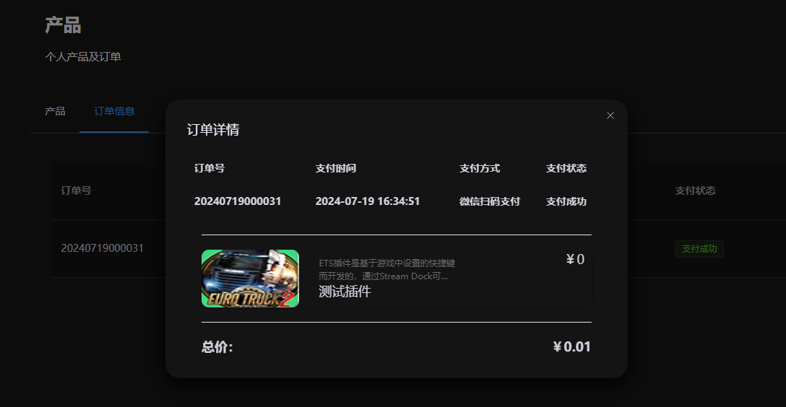
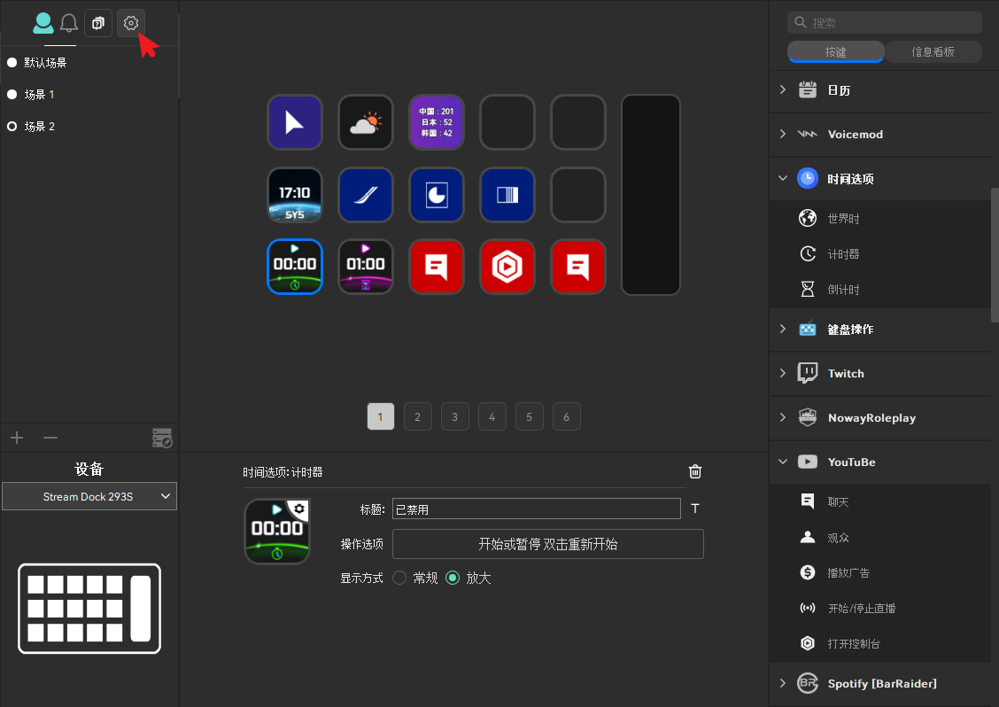

# **Space product market series problems**

## User's personal product order missing and status description

On June 19, 2024, due to scheduled maintenance, Space was officially put into service.

Based on user reactions, zpi files downloaded from the plug-in category may no longer show up in some Space account order history.

Stream Dock Settings as well as existing sounds and music will not be affected as these files are stored on your computer.

You can retrieve it for free from the Space or open the Stream Dock，In order to be re-associated with your account, and related products will be displayed in your account order history.

## Market availability in restricted countries

Due to legal requirements and payment processing restrictions, the Space Marketplace is currently inaccessible in certain countries.

includes:

- Cuba
- Syria
- Iran
- North Korea
- Donetsk People’s Republic
- Luhansk People’s Republic
- Bahrain
- Jordan
- Kuwait
- Oman
- Tunisia

For more information or questions, [contact us](https://bbs.key123.vip/)。

## Space and Stream Dock Built-in store

Space is a milestone for Mirabox, but it's time for a new chapter. Say hello to **Mirabox Store**说你好，your new discovery hub for plugins, icon libraries, profiles, and more.

Before you begin, it is critical to update to Stream Dock version 2.10.179.426. Otherwise, you will not be able to use the online web store [Space](https://space.key123.vip/)。

As we prepare for this exciting new chapter, you may be wondering what this means for the current Stream Dock App Store.

------

### **Why do you like Space**

------

Want to discover more ways to express yourself online? Or to simplify your workflow? Want to discover new styles and asset types of community makers, each verified by Mirabox?

All of this is possible on a growing Space with thousands of digital assets. And it's not just the Stream Dock, either. Space works with your most used creator apps, and there are many ways to personalize your Mirabox hardware and shape your online identity.

#### **🔌 Plugins**

All your favorite plugins - and then a few - are ready to be discovered. Dig deep and see what works for you.

#### **🖼️ Innovative icon**

Create an icon? Space gives you beautiful ICONS and even emojis.

#### **🧾 Streamlined account system**

Easily organized. The new account system neatly arranges your downloads so that you can search for the right type of product according to your preferences.

#### **🎨 Configuration files and screen savers**

For the first time, both asset types can be explored and downloaded directly on Space, without having to search in the built-in store to find them.

# Mirabox Space — How do I access your order history

*This guide will show you how to access your Elgato Marketplace order history.*

------

### **How do I access your order history**

------

1） Navigate to the [Space](https://space.key123.vip/)，Then click **Login** near the top right corner。

2） Once logged in, navigate to the Profile section in the top right corner. Click your portrait or shopping cart icon. From the drop-down menu that appears,select “**Individual center**”。

3） On the left sidebar, navigate to products and select **Order Information**.

4） Select the order ID to see more details.

#### Create a Space Account

To install new assets and continue receiving updates, you must first create a Mirabox Space account.All in all, the process only takes a few minutes. Once your account is ready, you can track downloads and notifications directly in Stream Deck, and then manage your entire digital collection in one place.

#### Stream Dock App Store What will change？

Soon, the Stream Dock App Store will no longer be available. For now, if you wish, you can continue to use the App Store as normal. However, be aware that any assets you install here may be out of date and will not receive new updates. The latest assets will only be available at Space.

------

### **How to get started and software update**

------

Getting into Mirabox Space is a breeze, here's how to get started

#### **💻 软件更新**

Do you already have a Stream Dock? Simply check for updates in the Stream Dock application to install the latest version of Space.

#### **🏪 步入 Mirabox 市场**

With your package, you can rest assured in [Mirabox market](https://space.key123.vip/). Create your account, explore and discover the tools to boost your content level.