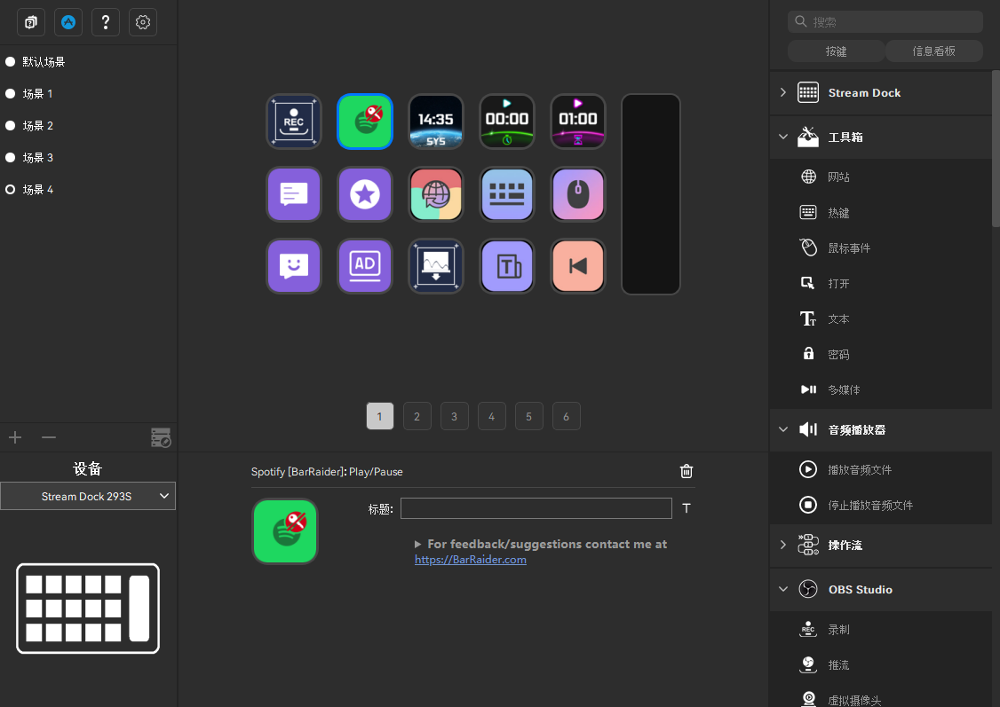
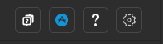
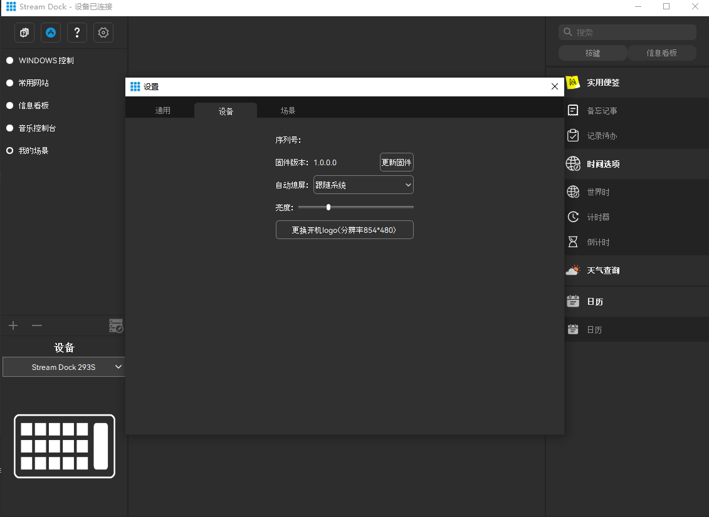
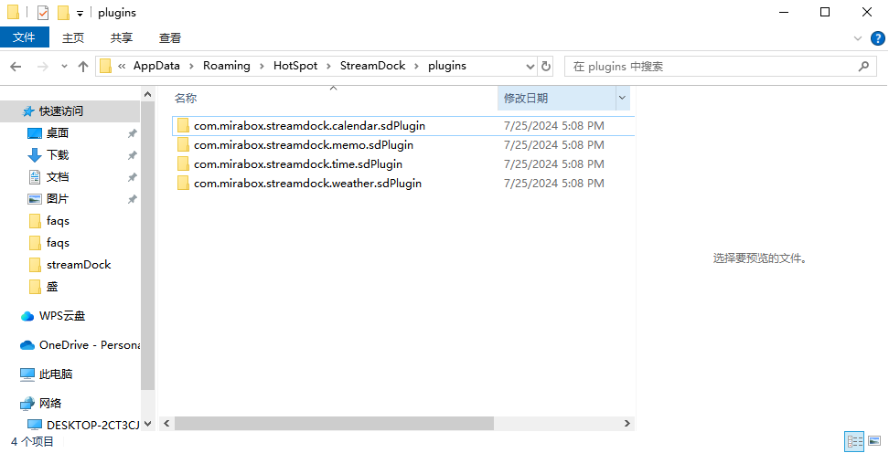
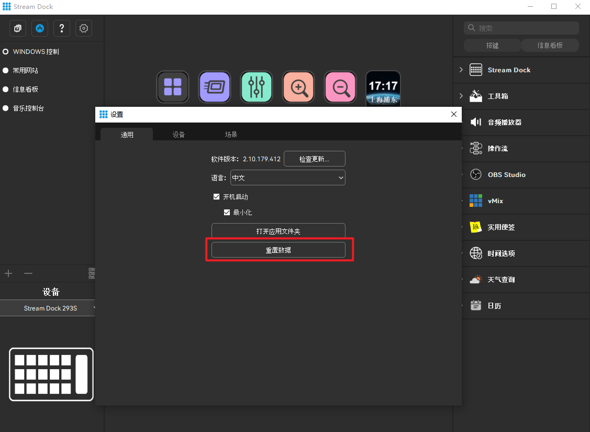
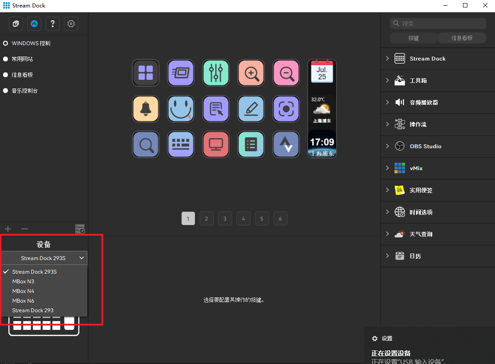
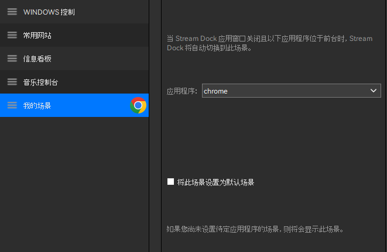
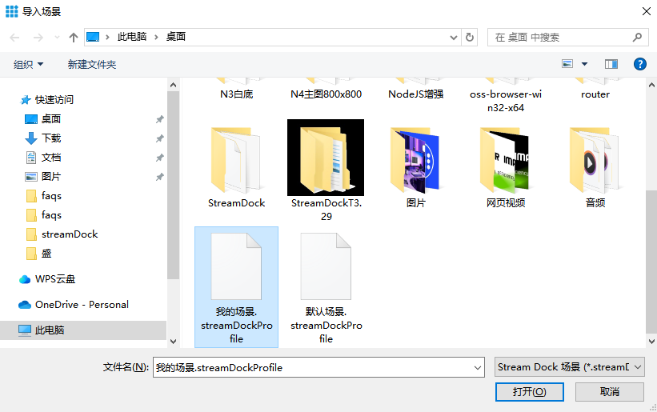

# **streamDock series problems**

## Mirabox — Firmware update

Firmware updates provide the latest improvements and bug fixes for Stream Dock.

**Attention:** When performing a firmware update, it is very important to ensure that the update is uninterrupted.When updating, please ensure that the following conditions are met:

- **⚠️ Do not turn off the computer.**
- **⚠️ Do not disconnect the Stream Dock.**
- **⚠️ Do not close or exit the Stream Dock application.**

------

### 1. Firmware update steps

------

1） Ensure that the latest Stream Dock software is installed.

- Check for updates in the Stream Dock software.
- Download the latest version from [https://miraboxdemo.key123.vip/downloads](https://miraboxdemo.key123.vip/downloads) 

2） Open the settings by clicking the settings gear next to the store button in the upper left corner of the software.。

3） Click **Update Firmware** to update.Do not disconnect the Stream Dock or turn off the computer during the firmware update.During the update process when the device is restarted, the key of the device may blink.

4） Wait until the update is complete, and then use Stream Dock as usual.

## How to assemble developed plug-ins or other products into stream Dock to run?

Many users have developed specialized products but don't know how to put them into the StreamDock to run their own products, which will be explained in detail step by step here.

*When you have developed your specialized products through the group development documentation SDK, you can put the packaged folder in the plugin folder and restart the software.*

------

### 1. Specific steps of integrating products developed by individuals into software operation

1）Open the software and click the Settings button in the upper left corner.

------

2）Select the head navigation **general** option of the pop-up box, and click **to open the application folder**

------

3）After that, a file interaction page will pop up to find the folder of the corresponding development product type. The plug-in corresponds to plugins, and the icon library corresponds to icons.

*The product storage path of software is C:\Users\OptiPlex\AppData\Roaming\HotSpot\StreamDock by default. *

***⚠️ Warning: Please do not modify the file storage path, as this may cause the stream Dock software to fail to operate normally.***

------

**4）Put the developed product folder in the corresponding product type directory, taking plugin as an example.**

***⚠️ Note: the file naming must be in the anti-domain naming format, which is used to identify the uniqueness of the software package or application.***

Example：com.mirabox.streamdock.calendar.sdPlugin

- **com**: This usually refers to the top-level domain name (TLD) of the domain name of a company or organization. Here, "com" stands for commercial organization, which is usually used to name software packages for commercial purposes.

- **mirabox**: This is a part of the name or domain name of a company or organization. It can be part of the company name, brand name or domain name.

- **streamdock**: This is the name of the product or service, that is, the corresponding software name.

- **calendar**: The name of the product you developed.

- **sdPlugin**: This identifies your product as a plugin.

- **sdIconPack**: This identifies your product as an icon.

------

## Some devices can not be displayed in the software.

**When you download and complete the installation of Steam Dock software, some devices cannot display the list of all devices at once.**

*Some versions and models will have this phenomenon, which may be the specific design for each different version of the software.*

**Solution:**

1）Try restarting the software.

2）Click Reset Data.

3）Restart the restart software after connecting to the corresponding hardware device.

- If you still can't solve the problem by using the above methods, or have any other doubts, you can [contact us](https://bbs.key123.vip/#/) at any time.

## How to use scene module correctly

### 1. Brief introduction of the scene

The appearance of the scene has greatly improved the usability and convenience of stream Dock, and the user experience has made a qualitative leap.

**Stream Dock can have multiple scenes.**,Users can customize their own exclusive scenes, including scene addition, deletion, design, import, export, naming, etc. Scenes can be switched back and forth, which is very friendly for heavy users of Stream Dock.

### 2. Latest scene

In the latest version of Stream Dock 2.10.179.426, four scenes are built in by default, namely, Windos control scene, common website scene, information billboard scene and music control scene.

- **Windows control scenario**

------

- **Common website scenes**

------

- **Information kanban scene**

------

- **Music control too scene**

### 3. Add a scene

1）Click the add icon in the scene list area or the settings page to create a new scene.

2）After adding new scenes, users can design exclusive scenes at will according to their own preferences.

### 4. Delete scene

After selecting the scene to be deleted, click the Delete icon in the scene list area or the setting page to delete the currently selected scene, or right-click the scene in the setting page to select Delete.

### 5. Scene renaming

双击或右击场景便可进行重命名

### 6. Double-click or right-click the scene to rename it.

The automatic scene switching function is not well-known to many users; But if you know this function, it will be very practical, and maybe you will love it.

Function of automatic switching: When you select the corresponding application for a scene, the stream Dock will automatically switch to the scene when you use the changed application in the future.

**have a try:**

1）Here to bind the selected Chrome application to my scene. After binding, the program icon will be displayed on the right side of the corresponding list item in the scene.

------

2）Switch to another scene

3）After opening Chrome, switching back to Stream Dock will automatically select the scene to which Chrome is bound.

### 7. Import and export of scenes

When you design a suitable scene and want to save it, or you want to share the changed scene with your friends and use it on other computers, you can use the import and export function.

You can export one piece of the designed scene, save it in the local file, save the binary file with the format of. streamDockProfile, and import the file with the corresponding format.

