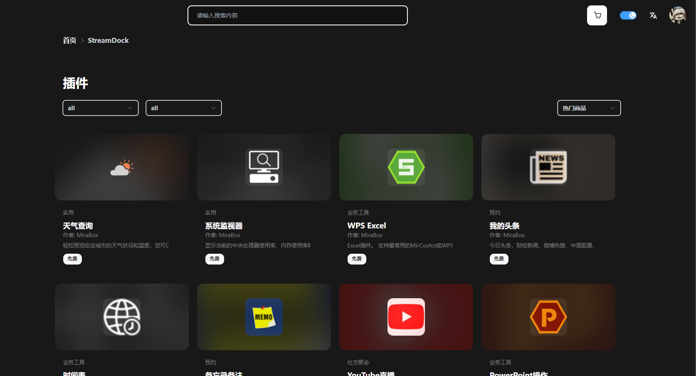
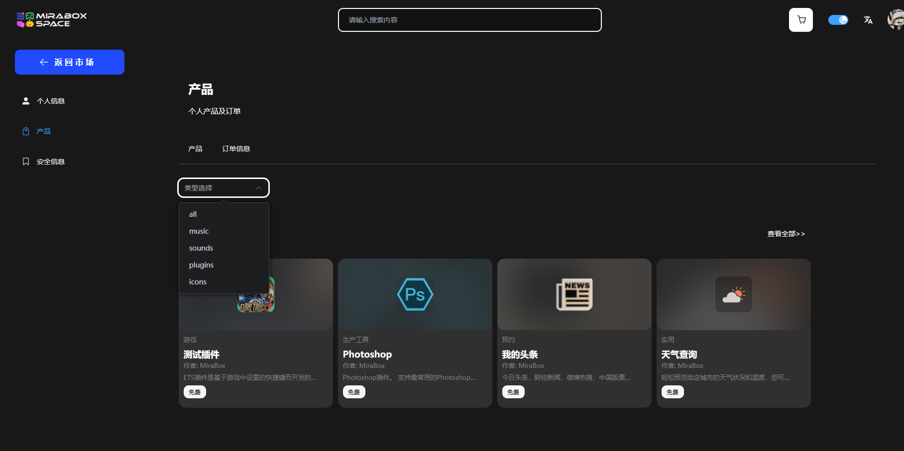

# **Space 产品市场系列问题**

## 用户个人产品订单缺失和状态说明

2024 年 6 月 19 日，由于定期维护，Space 正式投入使用。

据用户反应，从插件类别下载的zpi文件可能不再显示在某些 Space 帐户订单历史记录中。

Stream Dock 设置以及现有声音和音乐不会受到影响，因为这些文件存储在您的计算机上。

您可以从 Space 免费重新获取|打开Stream Dock，以便与您的帐户重新关联，并且相关产品将显示在您的帐户订单历史记录中。

## 受限制国家/地区的市场可用性

由于法律要求和支付处理限制，Space市场 目前在某些国家/地区无法访问。

此列表包括：

- 古巴
- 叙利亚
- 伊朗
- 朝鲜
- 顿涅茨克人民共和国
- 卢甘斯克人民共和国
- 巴林
- 约旦
- 科威特
- 阿曼
- 突尼斯

欲了解更多信息或问题，请联系[我们](https://bbs.key123.vip/)。

## Space 与 Stream Dock 内置商店

Space 是 Mirabox 的一个里程碑，但现在是时候翻开新的篇章了。对 **Mirabox 市场**说你好，这是您用于插件、图标库、配置文件等的新发现中心。

在开始之前，更新到 Stream Dock 版本 2.10.179.426 至关重要。否则，您将无法使用线上网页商店 [Space](https://space.key123.vip/)。

当我们为这个激动人心的新篇章做准备时，您可能想知道这对当前的 Stream Dock App Store 意味着什么。

------
### **1.为什么你会喜欢Space** 
------

想发现更多在线表达自己的方式吗？还是为了简化您的工作流程？想要发现社区制作者的新风格和产品类型，每个类型都经过 Mirabox验证？

在拥有数千种数字产品且不断增长的 Space 上，这一切都成为可能。而且也不仅仅是 Stream Dock。Space可与您最常用的创作者应用配合使用，有很多方法可以个性化您的 Mirabox 硬件并塑造您的在线身份。

#### **🔌插件**

所有你喜欢的插件——然后是一些——都准备好了，可以被发现。深入了解，看看有什么适合你的。

#### **🖼️ 新意图标**

创建图标？Space 为您提供了精美图标，甚至包括表情。

#### **🧾 精简账户体系**

轻松组织。新的帐户系统整齐地安排您的下载，您可以根据您的偏好，去搜索到相应类型产品。

#### **🎨 配置文件和屏幕保护程序**

这是第一次，这两种产品类型都可以直接在Space上探索和下载，无需在内置商店中搜索来找到它们。

# Mirabox Space — 如何访问您的订单历史记录

*本指南将向您展示如何访问您的Elgato Marketplace订单历史记录。*

------

### **2.如何访问您的订单历史记录**

------

1） 导航到 [Space](https://space.key123.vip/)，然后选择右上角附近的**登录**。

2） 登录后，导航到右上角的个人资料部分。单击您的肖像或购物车图标。从显示的下拉菜单中，选择“**管理帐户**”。

3） 在左侧边栏上，导航到产品并选择**订单信息**。

4） 选择订单 ID 以查看更多详细信息。

#### 创建 Space 帐户

要安装新产品并继续接收更新，您必须首先创建一个 Mirabox Space 帐户。总而言之，这个过程只需要几分钟。帐户准备就绪后，您可以直接在 Stream Deck 中跟踪下载和通知，然后在一个地方管理您的整个数字馆藏。

#### Stream Dock App Store 会发生什么变化？

很快，Stream Dock App Store 将不再可用。目前，如果您愿意，您可以继续正常使用 App Store。但是，请注意，您在此处安装的任何产品都可能已过时，并且不会收到新的更新。最新产品将仅在 Space 上架。

------

### **3.如何开始和软件更新**

------

进入 Mirabox Space 轻而易举，以下是入门方法

#### **💻 软件更新**

已经有 Stream Dock 了吗？只需在 Stream Dock 应用程序中检查更新，即可安装 Space 的最新版本。

#### **🏪 步入 Mirabox 市场**

有了您的软件套装，就可以放心进入 [Mirabox 市场](https://space.key123.vip/)了。创建您的帐户，探索并发现用于提升您的内容水平的工具。

## **为什么微信登录后无法更改密码**

当小伙伴们第一次使用微信登录后想更改密码却屡次尝试都是失败，卡在以下步骤

原因：因为该操作本来就不太合理，使用微信登录后不会自动手机号，所以第一次微信登录或注册进来的用户是默认没有绑定手机号的，需要自行绑定

1）微信用户可以进入[Space个人信息页面](https://space.key123.vip/userInfo)

2）找到**绑定手机号按钮**，并点击执行手机号绑定的操作

3）绑定成功后个人信息页面会显示相应的手机号

此时可以修改自己的密码了

***额外说明***：

*如果用户所绑定的手机号之前注册过，那么绑定之后，手机号注册的用户和微信用户将集合为同一个，用户信息、拥有的产品等也会集合在一起*

*目前微信支持绑定手机号，邮箱绑定的需求是否需要还在确定当中，敬请期待！*

